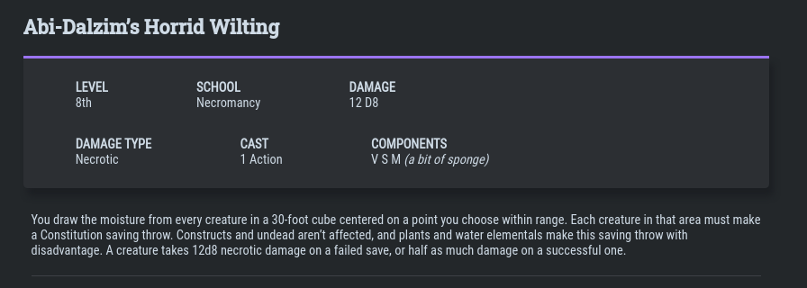

## Trabalho 4 - Linguagem DnD
---
## 1  A Linguagem DnD

Com base na utilização e criação de *spells* (feitiços) para o jogo *Dungeons & Dragons*, a linguagem DnD serve para registrar os *spells* de um jogador com seus atributos obrigatórios e opcionais. Além disso, a linguagem possui um simples sistema de tipos para uma maior flexibilidade das atribuições e maior possibilidade de customização e de criação de novos sistemas e regras para o jogo.


## 1.1 Tipos:

Os tipos existentes na linguagem são: `int` que recebe valores inteiros, `school` e `text` que recebem *strings*, com a diferença que variaveis do tipo `school` só podem ser atribuidas para a *tag* `SCHOOL`.

| Nome    | Tipo de Dado  |
|---------|----------|
| int     | inteiro  | 
| text    | string   |
| school  | string   |

## 1.2 *Spells*


Cada *spell* é definido por quatro *tags* obrigatórias, sendo elas:
- `NAME` - Nome do *spell* (pode ser uma variável do tipo `text`);
- `LEVEL` - É o nível necessário para o personagem conseguir conjurar o *spell* (pode ser uma variável do tipo `int`);
- `SCHOOL` - De qual escola de magia o *spell* pertence. (pode ser uma variável do tipo `school`);
- `DESCR` - Uma descrição geral dos efeitos gerados pelo uso do *spell* (pode ser uma variável do tipo `text`).

Além disso, cada *spell* pode conter até 4 *tags* opcionais, sendo elas:
- `DAMAGE` - Caso a magia cause dano ao oponente, a tag `DAMAGE` indicará quantos dados de dano o *spell* pode causar (pode ser uma variável do tipo `int` acompanhado de alguma palavra reservada indicando o dado utilizado);

- `DAMAGE TYPE` - Caso a magia cause dano ao oponente, a tag `DAMAGE` indicará o tipo de dano que o *spell* irá causar (pode ser uma variável do tipo `text`);
- `CAST` - O tempo necessário em tempo de jogo que a magia leva para ser conjurada (pode ser uma variável do tipo `int` acompanhado de alguma palavra reservada indicando a unidade de tempo utilizada).
- `COMPONENTS` - Os componentes necessários para conjuração da magia, eles podem ser: 

    - ` V (Verbal)` - Palavras ou frases mágicas que devem ser ditas para a conjuração da magia;
    - `S (Somatico)` - Gestos precisos que devem ser articulados para a conjuração da magia;
    - `M (Material)` - Algum item físico necessário para a conjuração da magia. (necessita de uma variável do tipo `text` para indicar o item utilizado)

### 1.2.1 Exemplo
Exemplo da definição de um *spell*:
```
% definição do spell abi-dalzim's horrid wilting
def abi {
    NAME: "Abi-Dalzim’s Horrid Wilting",
    DESCR: "You draw the moisture from every creature in a 30-foot cube centered on a point you choose within range.",
    LEVEL: 8,
    SCHOOL: Necromancy,
    DAMAGE: 12 D8,
    DMG_TYPE: "Necrotic",
    CAST: 1 Action,
    COMP: V S M "a bit of sponge"
}
```
---

## 2  Instruções para Execução
### 2.1  Dependências 
* Download Antlr4
```
cd /usr/local/lib
curl -O https://www.antlr.org/download/antlr-4.9-complete.jar 
```
* Adicionar o Antlr4 para o ```ClassPath```:
```
export CLASSPATH=".:/usr/local/lib/antlr-4.9-complete.jar:$CLASSPATH"
```
* Criar aliases para o Antlr:
```
alias antlr4='java -Xmx500M -cp "/usr/local/lib/antlr-4.9-complete.jar:$CLASSPATH" org.antlr.v4.Tool'
```

* Antlr4-python3-runtime (a versão do pip deve ser a mesma do Antlr)
```
sudo pip install antlr4-python3-runtime==<versão do Antlr instalada>
```

### 2.2  Gerando a gramática
```
antlr4 -Dlanguage=python3 -visitor DND.g4
```

### 2.3 Utilizando a linguagem
```
python3 DND/DNDCompiler.py <arquivo> <pasta de saída>
python3 DND/DNDCompiler.py <arquivo> #irá para uma pasta default chamada result
```


### 2.4 Rodando Casos de Teste
```
chmod +x run
./run
```

